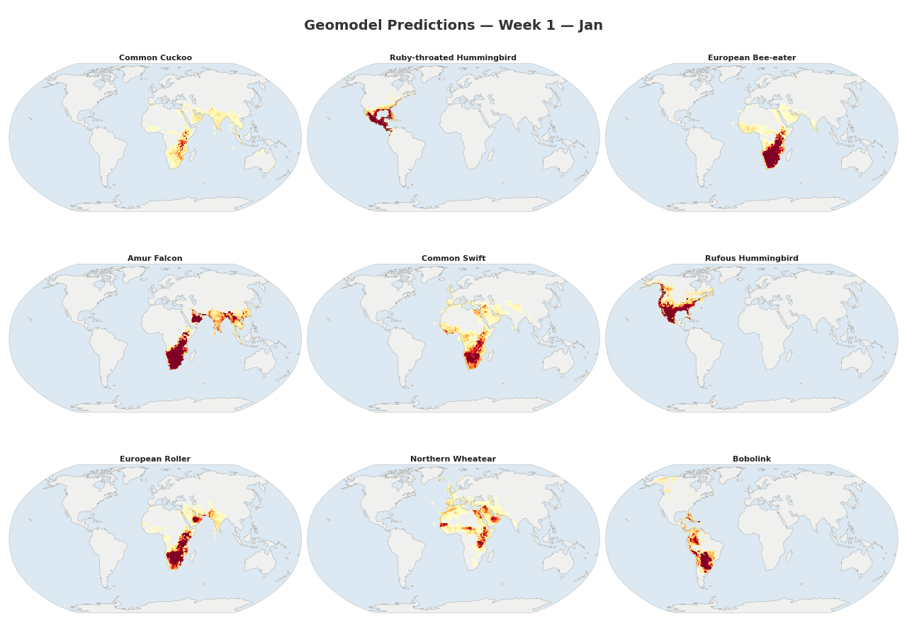

<p align="center">
  
</p>

<h1 align="center">BirdNET Geomodel</h1>

<p align="center">
  <a href="https://github.com/birdnet-team/geomodel/blob/main/LICENSE"></a>
  <a href="https://www.python.org/"></a>
  <a href="https://pytorch.org/"></a>
  <a href="https://birdnet-team.github.io/geomodel/"></a>
</p>

<p align="center">
  Spatiotemporal species occurrence prediction for post-filtering BirdNET acoustic detections.<br>
  Predicts which species are likely to occur at a given location and week of the year.
</p>

<p align="center">
  
</p>

<p align="center">
  <a href="https://birdnet-team.github.io/geomodel/"><b>Documentation</b></a> · <a href="CONTRIBUTING.md"><b>Contributing</b></a> · <a href="LICENSE"><b>License</b></a>
</p>

## Setup

```bash
git clone https://github.com/birdnet-team/geomodel.git
cd geomodel
python3 -m venv .venv && source .venv/bin/activate

# Linux: install geospatial system libraries
sudo apt install -y build-essential python3-dev gdal-bin libgdal-dev \
    libproj-dev proj-data proj-bin libgeos-dev libspatialindex-dev

pip install -r requirements.txt
```

Authenticate with Google Earth Engine: `earthengine authenticate`

## Pipeline

```
1. geoutils.py   — Build H3 grid + sample Earth Engine environmental data
2. gbifutils.py  — Process raw GBIF occurrence archive → filtered CSV
3. combine.py    — Join geodata + GBIF → training parquet + taxonomy CSV
4. train.py      — Train multi-task model → checkpoints
5. predict.py    — Inference: (lat, lon, week) → species list
```

```bash
# 1. Sample environmental data on H3 grid
python utils/geoutils.py --km 350 --out-dir outputs/global_chunks \
    --threads 8 --combine --combined-out data/global_350km_ee.parquet --fill-missing

# 2. Process GBIF archive
python utils/gbifutils.py --gbif /path/to/gbif_archive.zip --file occurrence.txt \
    --output ./outputs/gbif_processed.csv.gz --taxonomy taxonomy.csv

# 3. Combine
python utils/combine.py --geodata data/global_350km_ee.parquet \
    --gbif ./outputs/gbif_processed.csv.gz --output ./outputs/combined.parquet

# 4. Train
python train.py --data_path ./outputs/combined.parquet --model_scale 1.0 --num_epochs 100

# 5. Predict
python predict.py --lat 50.83 --lon 12.92 --week 22
```

See the [documentation](https://birdnet-team.github.io/geomodel/) for detailed usage, model architecture, and visualization scripts.

## Model

A multi-task neural network that learns spatial-temporal patterns from coordinates alone:

- **Input:** Raw (lat, lon, week) — circular encoding is handled inside the model
- **Primary task:** Multi-label species classification (BCE default; ASL, focal, AN also available)
- **Auxiliary task:** Environmental feature regression (training only, acts as regularizer)
- **Habitat head** (optional, `--habitat_head`)**:** predicted env features → species logits, combined with direct head via learned gate — makes environment→species relationships explicit
- **Scalable:** ~1.8M (scale=0.5) to ~36M (scale=2.0) parameters with ~12K species (default scale=1.0 ≈ 7M)
- **Tiny footprint:** Under 10 MB (≈ 3 MB at FP16) — replaces hundreds of MB of raw eBird/iNat observation data while interpolating into survey gaps and smoothing geographic biases

## Visualization

```bash
# Per-species weekly probability charts
python scripts/plot_species_weeks.py --lat 50.83 --lon 12.92

# Seasonal range maps
python scripts/plot_range_maps.py --species "Barn Swallow" --bounds europe

# Species richness heatmap
python scripts/plot_richness.py --week 26

# Ground truth overlay (pass training parquet to any of the above)
python scripts/plot_species_weeks.py --lat 50.83 --lon 12.92 --data_path outputs/combined.parquet
python scripts/plot_range_maps.py --species "Barn Swallow" --data_path outputs/combined.parquet
python scripts/plot_richness.py --week 26 --data_path outputs/combined.parquet

# Variable importance (Spearman correlations)
python scripts/plot_variable_importance.py --species "Great Tit" --data_path data.parquet

# Environmental feature maps
python scripts/plot_environmental.py --input data/global_350km_ee.parquet
```

## Project Structure

```
geomodel/
├── train.py                 # Training (Stage 4)
├── predict.py               # Inference (Stage 5)
├── convert.py               # Export to ONNX / TFLite / TF SavedModel
├── model/
│   ├── model.py             # Neural network architecture
│   └── loss.py              # Multi-task loss functions
├── utils/
│   ├── geoutils.py          # H3 grid + Earth Engine (Stage 1)
│   ├── gbifutils.py         # GBIF processing (Stage 2)
│   ├── combine.py           # Join geodata + GBIF (Stage 3)
│   └── data.py              # Dataset / DataLoader / preprocessing
├── scripts/                 # Plotting & diagnostic scripts
├── docs/                    # MkDocs documentation source
│   └── demo/                # Interactive web demo (ONNX Runtime Web)
├── demo/                    # Demo assets (ONNX model + labels)
└── checkpoints/             # Model checkpoints + labels.txt
```

## Interactive Demo

An interactive web demo is included under `docs/demo/`. It runs the ONNX FP16 model entirely client-side using [ONNX Runtime Web](https://onnxruntime.ai/docs/tutorials/web/) — no server-side inference needed.

Features:
- **Range Map** — select a species to see its predicted occurrence probability on a Leaflet map. Resolution adapts to the zoom level (coarser when zoomed out, finer when zoomed in).
- **Richness Map** — predicted species count per grid cell, color-coded from low to high.
- **Species List** — click any location to see all predicted species for that point.
- **Week selector** — choose any of the 48 weeks of the year.

### Running the docs locally

```bash
# Install docs dependencies (once)
pip install -r requirements-docs.txt

# Start the MkDocs dev server
mkdocs serve

# Or specify a custom address
mkdocs serve -a 0.0.0.0:8000
```

Then open <http://localhost:8000/demo/> in your browser.

## Citation

```bibtex
@article{birdnet-geomodel,
  title={Using Spatiotemporal Occurrence Models to Post-Filter BirdNET Acoustic Detections},
  author={Kahl, Stefan and Mauermann, Max and Lasseck, Mario and Wood, Connor and Klinck, Holger},
  year={2025},
}
```

## License
This project is licensed under the MIT License - see the [LICENSE](LICENSE) file for details.

## Funding

Our work in the K. Lisa Yang Center for Conservation Bioacoustics is made possible by the generosity of K. Lisa Yang to advance innovative conservation technologies to inspire and inform the conservation of wildlife and habitats.

The development of BirdNET is supported by the German Federal Ministry of Research, Technology and Space (FKZ 01|S22072), the German Federal Ministry for the Environment, Climate Action, Nature Conservation and Nuclear Safety (FKZ 67KI31040E), the German Federal Ministry of Economic Affairs and Energy (FKZ 16KN095550), the Deutsche Bundesstiftung Umwelt (project 39263/01) and the European Social Fund.

## Partners

BirdNET is a joint effort of partners from academia and industry.
Without these partnerships, this project would not have been possible.
Thank you!


