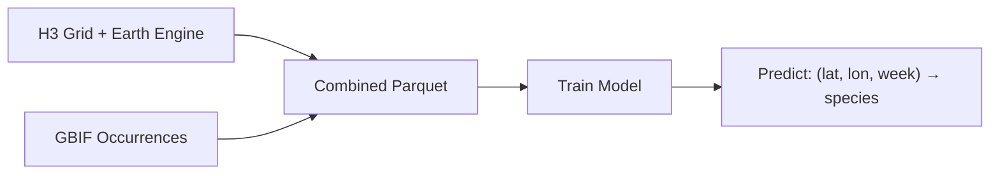

  

# BirdNET Geomodel

**Spatiotemporal species occurrence prediction for post-filtering BirdNET acoustic detections.**

BirdNET Geomodel predicts which species are likely to occur at a given location and time of year. It uses a multi-task neural network trained on [GBIF](https://www.gbif.org/) occurrence data and environmental features from [Google Earth Engine](https://earthengine.google.com/), producing well-calibrated species occurrence probabilities useful for filtering acoustic detection results from [BirdNET](https://birdnet.cornell.edu/).

---

## How It Works

The model learns spatial and temporal patterns from species observation data:

1. **Environmental sampling** — An H3 hexagonal grid covers the globe; each cell is enriched with environmental features (elevation, climate, land cover, etc.) from Google Earth Engine.
2. **Occurrence data** — GBIF observations are mapped onto the H3 grid, producing per-cell, per-week species lists.
3. **Multi-task training** — A neural network learns to predict species occurrence from raw (latitude, longitude, week) inputs, using environmental reconstruction as an auxiliary training signal.
4. **Inference** — Given any coordinate and week, the model outputs a ranked list of species with occurrence probabilities.

## Key Features

- **No environmental data needed at inference** — the model encodes spatial and temporal patterns from coordinates alone
- **Multi-harmonic circular encoding** — properly handles periodicity of lat/lon and week-of-year
- **Scalable** — handles millions of training samples with sparse species encoding and mixed-precision training
- **Rich visualization** — range maps, seasonal occurrence charts, richness maps, variable importance plots

## Quick Links

- [Installation](getting-started/installation.md) — set up the environment
- [Quick Start](getting-started/quickstart.md) — run the full pipeline end to end
- [Model Architecture](model/architecture.md) — how the neural network works
- [API Reference](api/model.md) — Python API documentation
- [GitHub Repository](https://github.com/birdnet-team/geomodel)
