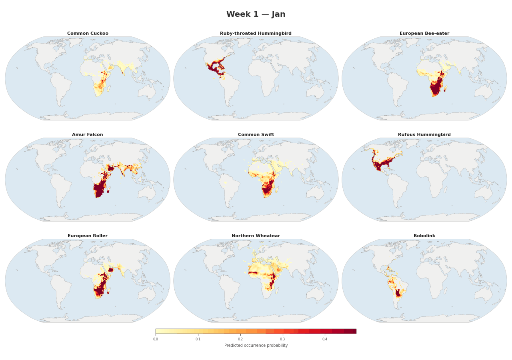
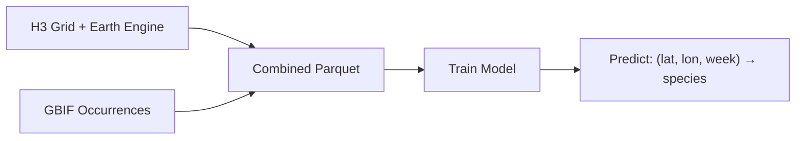

  

# BirdNET Geomodel

**Spatiotemporal species occurrence prediction for post-filtering BirdNET acoustic detections.**

BirdNET Geomodel predicts which species are likely to occur at a given location and time of year. It uses a multi-task neural network trained on [GBIF](https://www.gbif.org/) occurrence data and environmental features from [Google Earth Engine](https://earthengine.google.com/), producing species occurrence probabilities that serve as a prior for filtering acoustic detection results from [BirdNET](https://birdnet.cornell.edu/).

  

Figure 1: Animated range maps of 12 migratory species across 48 weeks of the year. Each frame shows predicted occurrence probabilities for a single week, with darker colors indicating higher probabilities.

## What It Is — and What It Isn't

The geomodel is a **convenience tool for casual users and citizen scientists** who want to get the most out of BirdNET without expert ornithological knowledge. If you don't know which birds to expect at your recording location, the geomodel provides a reasonable prior that helps BirdNET suppress unlikely species and surface the most plausible detections.

It is **not** a precise species distribution model. The predictions are intentionally coarse — "good enough" to improve acoustic classification, but not intended for scientific range analyses or conservation planning. Researchers who know their study area and the species they expect should use a **custom species list** curated by domain experts instead of relying on the geomodel. An expert-crafted list will always outperform an automated prior.

In short: the geomodel exists so that beginners don't have to guess which species might be present. If you already know, you don't need it.

### Why a model instead of a lookup table?

An alternative approach would be to query eBird or iNaturalist observation databases directly, but that requires shipping hundreds of megabytes of occurrence data and building spatial indices on the client. The trained geomodel achieves comparable results in under 10 MB (≈ 3 MB at FP16) — small enough to bundle with any mobile or embedded application.

Because the model learns continuous spatial and temporal patterns rather than memorizing discrete observations, it also **interpolates** into areas with sparse or no survey coverage and **smooths out geographic biases** in the observation record (e.g. heavily surveyed regions like the US vs. under-surveyed tropical forests). A raw lookup table can only tell you what has been reported; the model can make reasonable predictions where nobody has looked yet.

---

## How It Works

The model learns spatial and temporal patterns from species observation data:

1. **Environmental sampling** — An H3 hexagonal grid covers the globe; each cell is enriched with environmental features (elevation, climate, land cover, etc.) from Google Earth Engine.
2. **Occurrence data** — GBIF observations are mapped onto the H3 grid, producing per-cell, per-week species lists.
3. **Multi-task training** — A neural network learns to predict species occurrence from raw (latitude, longitude, week) inputs, using environmental reconstruction as an auxiliary training signal.
4. **Inference** — Given any coordinate and week, the model outputs a ranked list of species with occurrence probabilities.

## Key Features

- **No environmental data needed at inference** — the model encodes spatial and temporal patterns from coordinates alone
- **Multi-harmonic circular encoding** — properly handles periodicity of lat/lon and week-of-year
- **Scalable** — handles millions of training samples with sparse species encoding and mixed-precision training
- **Rich visualization** — range maps, seasonal occurrence charts, richness maps, variable importance plots

## Quick Links

- [Installation](getting-started/installation.md) — set up the environment
- [Quick Start](getting-started/quickstart.md) — run the full pipeline end to end
- [Model Architecture](model/architecture.md) — how the neural network works
- [API Reference](api/model.md) — Python API documentation
- [GitHub Repository](https://github.com/birdnet-team/geomodel)

## License

The source code is licensed under the [MIT License](https://github.com/birdnet-team/geomodel/blob/main/LICENSE).

Trained model weights are licensed under [Creative Commons Attribution-ShareAlike 4.0 International (CC BY-SA 4.0)](https://creativecommons.org/licenses/by-sa/4.0/).
See the [Terms of Use](https://github.com/birdnet-team/geomodel/blob/main/TERMS_OF_USE.md) for full terms.
