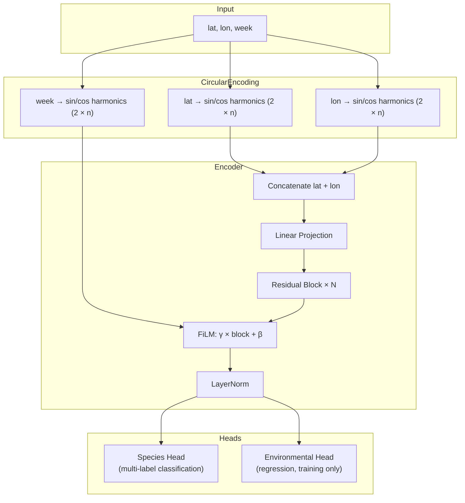

# Model Architecture

The BirdNET Geomodel is a multi-task neural network that predicts species occurrence from raw location and time inputs.

## Design Philosophy

The model is designed with a key constraint: **at inference time, only latitude, longitude, and week number are needed**. No environmental data, no preprocessing — just three numbers.

To make this work, the model learns spatial and temporal patterns during training by jointly predicting:

1. **Species occurrence** (primary task) — which species are present at a location/time
2. **Environmental features** (auxiliary task) — what the environment looks like at a location

The auxiliary task acts as a regularizer, encouraging the model to learn meaningful spatial representations even when species labels are sparse.

## Architecture Overview

## Components

### Circular Encoding

Raw coordinates and week numbers are poor inputs for neural networks — the model wouldn't know that longitude -180° and +180° are the same place, or that week 48 is adjacent to week 1.

**Circular encoding** solves this by mapping each value to sine/cosine pairs at multiple harmonics (Tancik et al., 2020):

$$
\text{encode}(\theta) = [\sin(\theta), \cos(\theta), \sin(2\theta), \cos(2\theta), \ldots, \sin(n\theta), \cos(n\theta)]
$$

- **Latitude**: degrees → radians, then encoded with `coord_harmonics` harmonics (default 8 → 16 features)
- **Longitude**: same as latitude (16 features)
- **Week**: mapped to $[0, 2\pi)$ over 48 weeks, then encoded with `week_harmonics` harmonics (default 4 → 8 features)

Spatial input features: $2 \times 2 \times \text{coord\_harmonics}$ = 32 by default.  Week features (8) are used for FiLM conditioning rather than concatenated.

Year-round predictions (week 0) are computed at inference time as the **max** across all 48 weekly predictions — no special week-0 encoding is needed.

### Shared Encoder (`SpatioTemporalEncoder`)

The encoder maps spatial coordinates into a rich embedding, **modulated by temporal information** via FiLM (Feature-wise Linear Modulation; Perez et al., 2018):

1. **Spatial projection**: Concatenated lat+lon circular features → Linear to `embed_dim` (default 512)
2. **Residual blocks** — each block applies LayerNorm → GELU → Linear → LayerNorm → GELU → Dropout → Linear with a skip connection.  All LayerNorm layers use `eps=1e-4` (above the FP16 minimum normal ~6e-5) so that the epsilon retains full precision after half-precision quantisation.
3. **FiLM conditioning** — after each residual block, the week encoding generates per-block scale (γ) and shift (β) parameters: $x' = \gamma \cdot \text{block}(x) + \beta$.  This forces the model to actively modulate spatial representations based on the time of year.
4. **Final LayerNorm** for stable downstream processing

The pre-norm residual design ensures stable training and strong gradient flow even with many blocks.

### Species Prediction Head

A multi-label classification head that outputs one logit per species:

1. Residual blocks for further processing
2. **Low-rank bottleneck**: instead of a single large Linear(hidden → n_species), the head uses Linear(hidden → bottleneck) → GELU → Linear(bottleneck → n_species)

The bottleneck (default 128) dramatically reduces parameters when n_species is large (10K+) and learns a compact species-embedding space whose dimensions can be interpreted as latent ecological niches.

Output: raw logits (apply sigmoid for probabilities).

### Environmental Prediction Head

A regression head that predicts normalized environmental features (elevation, temperature, precipitation, etc.) from the shared embedding. Only used during training as an auxiliary objective.

## Model Scaling

Model capacity is controlled by a continuous scaling factor (`--model_scale`).
All dimensions scale linearly from the reference point at `1.0`; block counts
are rounded to the nearest integer (minimum 1).

Approximate parameter counts assume ~12K species (the species head's final
layer adds `bottleneck × n_species` parameters, so the total varies with
vocabulary size):

| Scale | Embed Dim | Encoder Blocks | Species Head      | Bottleneck | Approx. Parameters |
|-------|-----------|----------------|-------------------|------------|-------------------|
| 0.25  | 128       | 1              | 128, 1 block      | 32         | ~0.5M             |
| 0.50  | 256       | 2              | 256, 1 block      | 64         | ~1.8M             |
| 0.75  | 384       | 3              | 384, 2 blocks     | 96         | ~3.8M             |
| 1.00  | 512       | 4              | 512, 2 blocks     | 128        | ~7.2M             |
| 1.25  | 640       | 5              | 640, 2 blocks     | 160        | ~12.4M            |
| 1.50  | 768       | 6              | 768, 3 blocks     | 192        | ~21.2M            |
| 1.75  | 896       | 7              | 896, 4 blocks     | 224        | ~33.2M            |
| 2.00  | 1024      | 8              | 1024, 4 blocks    | 256        | ~36M              |

The "+ species" part scales with the number of species in the vocabulary (bottleneck × n_species parameters).

## Encoding Parameters

| Parameter | Default | Effect |
|---|---|---|
| `--coord_harmonics` | 8 | Higher values capture finer spatial patterns (more harmonics) |
| `--week_harmonics` | 4 | Higher values capture sharper weekly transitions |

!!! tip "Choosing harmonics"
    The default values (8 coordinate, 4 week) work well for global models. Higher harmonics add capacity for finer-grained patterns but increase input dimensionality and risk overfitting on small datasets.

## References

> Perez, E., Strub, F., de Vries, H., Dumoulin, V., & Courville, A. (2018). FiLM: Visual Reasoning with a General Conditioning Layer. In *AAAI Conference on Artificial Intelligence* (pp. 3942–3951).

> Tancik, M., Srinivasan, P.P., Mildenhall, B., Fridovich-Keil, S., Raber, N., Barron, J.T., & Ng, R. (2020). Fourier Features Let Networks Learn High Frequency Functions in Low Dimensional Domains. In *Advances in Neural Information Processing Systems* (pp. 7537–7547).
