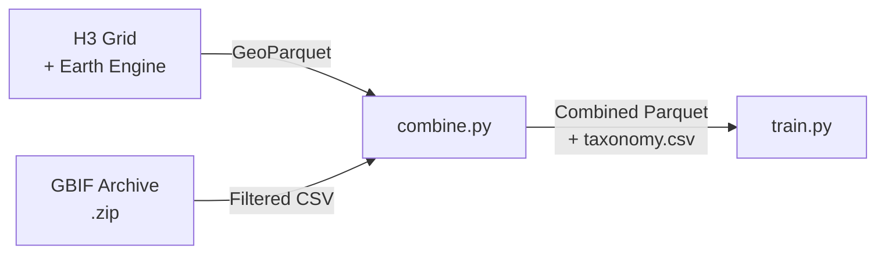

# Data Pipeline Overview

The data pipeline transforms raw geospatial and biodiversity data into training-ready datasets through three stages:

## Stage 1 — Earth Engine Environmental Data

[`utils/geoutils.py`](geoutils.md) builds a global H3 hexagonal grid and samples environmental features from Google Earth Engine for each cell.

**What it produces:** A GeoParquet file where each row is an H3 cell with environmental features (elevation, temperature, precipitation, land cover, water fraction, etc.).

## Stage 2 — GBIF Occurrence Processing

[`utils/gbifutils.py`](gbif.md) processes raw GBIF Darwin Core Archive downloads into a clean, filtered CSV of species observations with location, week, and taxonomy.

**What it produces:** A gzipped CSV with columns: `latitude`, `longitude`, `taxonKey`, `verbatimScientificName`, `commonName`, `week`, `class`.

## Stage 3 — Combine

[`utils/combine.py`](combine.md) joins the H3 environmental grid with species observations. Each GBIF observation is mapped to its nearest H3 cell and assigned to a week, producing per-cell, per-week species lists.

**What it produces:**

- A combined parquet with `h3_index`, environmental features, and `week_1`…`week_48` columns (each containing a list of taxonKeys observed that week)
- A taxonomy CSV mapping taxonKey to scientific and common names

## H3 Hexagonal Grid

The project uses [Uber's H3](https://h3geo.org/) hierarchical hexagonal grid system as its spatial unit. H3 cells are approximately equal in area and tile the globe uniformly — unlike lat/lon grids which distort at the poles.

The `--km` flag in `geoutils.py` controls the target cell diameter. For example, `--km 50` produces cells roughly 50 km across (H3 resolution 3).

## Environmental Features

Each H3 cell is enriched with the following features from Earth Engine:

| Feature | Source | Description |
|---|---|---|
| `water_fraction` | JRC Global Surface Water | Fraction of cell covered by water (0–1) |
| `elevation_m` | SRTM / GMTED | Mean elevation in meters |
| `temperature_c` | WorldClim BIO01 | Mean annual temperature (°C) |
| `precipitation_mm` | WorldClim BIO12 | Annual precipitation (mm) |
| `landcover_class` | MODIS MCD12Q1 LC_Type1 | IGBP land cover class (integer) |
| `urban_fraction` | MODIS (classes 13/14) | Built-up area fraction (0–1) |
| `canopy_height_m` | NASA/JPL | Mean canopy height (meters) |
